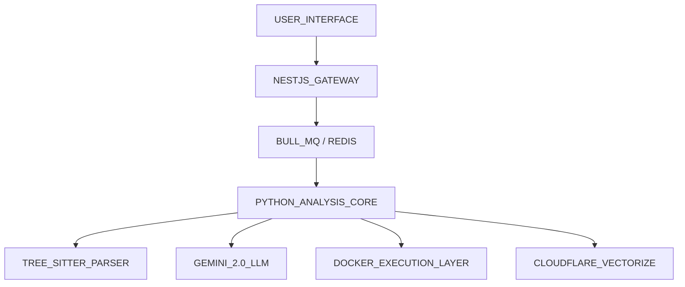

# REPOLENS // ARCHITECTURAL_DIAGNOSTIC_ENGINE

RepoLens is a high-performance repository indexing and architectural analysis platform. It transforms complex software systems into structured, navigable knowledge bases using deep AST parsing and neural synthesis.

---

### CORE_CAPABILITIES

- **SYSTEM_INTELLIGENCE**: Automated discovery of build protocols, CI/CD pipelines, and infrastructure layers.
- **SPATIAL_MAPPING**: Interactive 2D hierarchical visualization of module dependencies and complexity heatmaps.
- **NEURAL_SYNTHESIS**: Principal Engineer level architectural documentation generated via Gemini 2.0 Thinking models.
- **ISOLATED_RUNTIME**: Secure, native Docker sandbox for real-time verification of code snippets and logic.
- **SEMANTIC_MEMORY**: Multi-modal indexing using Gemini Embeddings and Cloudflare Vectorize for repository-wide RAG.

---

### SYSTEM_ARCHITECTURE

---

### DEPLOYMENT_PROTOCOLS

#### PRODUCTION_STACK (AWS_EC2)
The backend is optimized for AWS EC2 (t3.small) to support native Docker execution.
Refer to [docs/EC2_DEPLOYMENT.md](./docs/EC2_DEPLOYMENT.md) for initialization instructions.

#### FRONTEND_LAYER (VERCEL)
Next.js 14 App Router, styled with a high-contrast monotone aesthetic and choreographed motion design.

---

### TECHNICAL_SPECIFICATION

- **Primary Stack**: TypeScript, Python, Node.js.
- **AI Core**: Google Gemini 2.0 Flash / Pro.
- **Data Layer**: Neon (PostgreSQL), Upstash (Redis), Cloudflare (Vectorize).
- **Security**: 0px radius geometry, pure monotone contrast, zero-emoji protocol.

---

### SYSTEM_STATUS

- **Phase 1: System Intelligence**: COMPLETED
- **Phase 2: Live Execution**: COMPLETED
- **Phase 3: Deep Process Analysis**: IN PROGRESS
- **Phase 4: Spatial Blueprint**: IN PROGRESS

---

### MAINTENANCE_AND_CONTRIBUTION

Development requires Node.js 18+ and Python 3.11+. 
See [DEVELOPMENT.md](./DEVELOPMENT.md) for local environment setup.

(C) 2026 REPOLENS // ARCHITECTURAL_ARCHIVE_VAULT